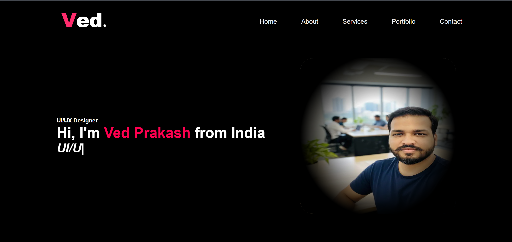
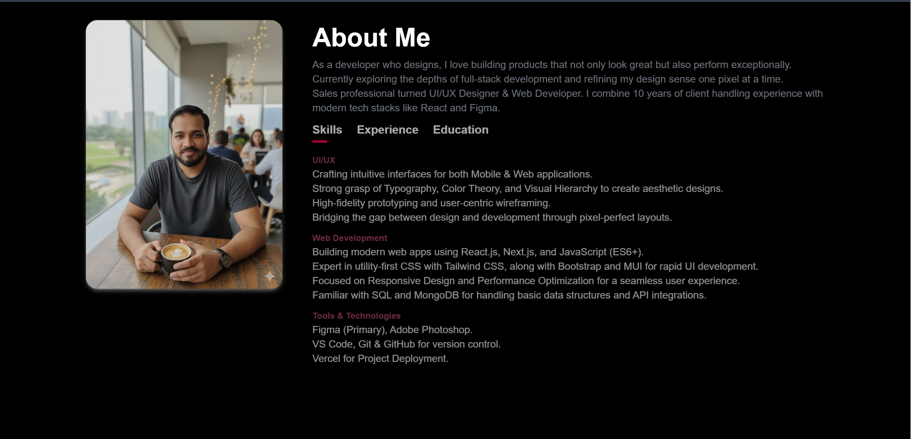
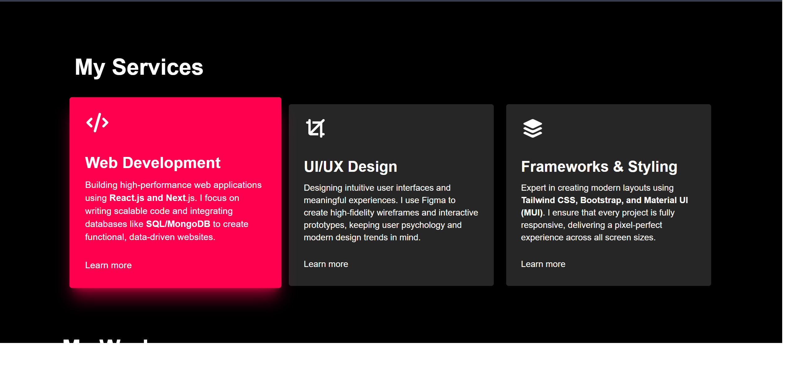
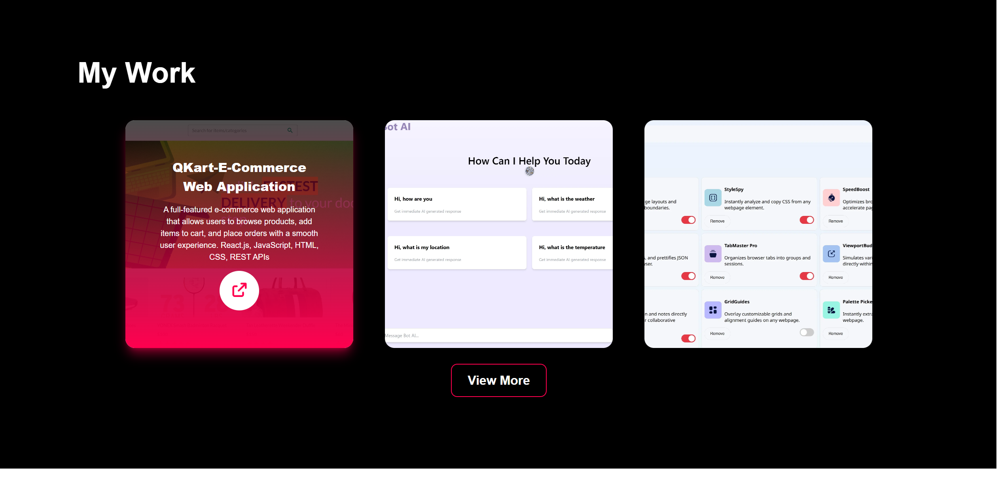
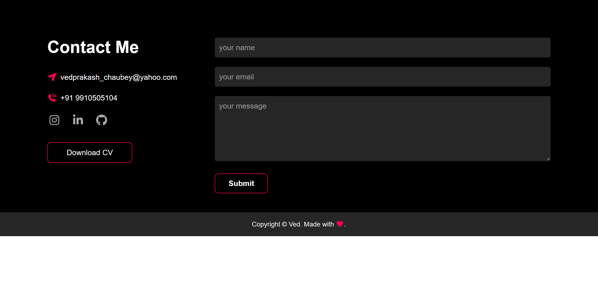
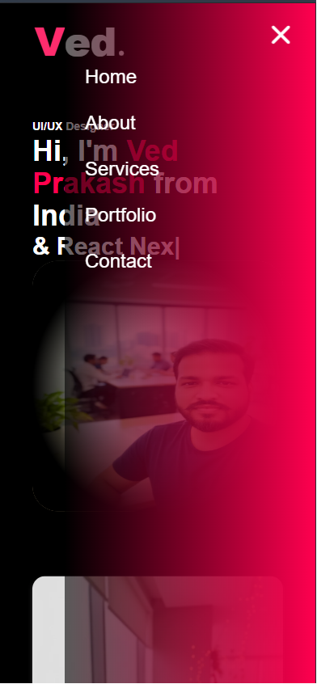
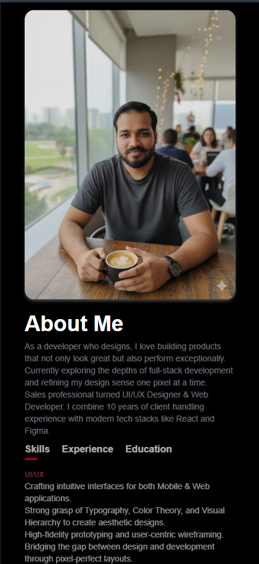
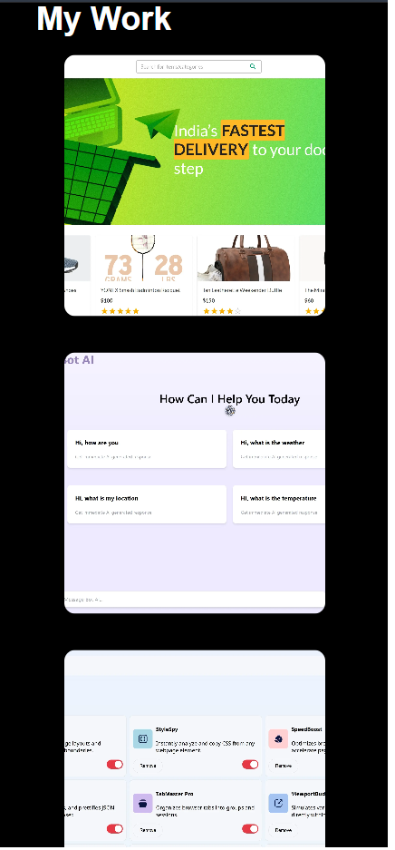
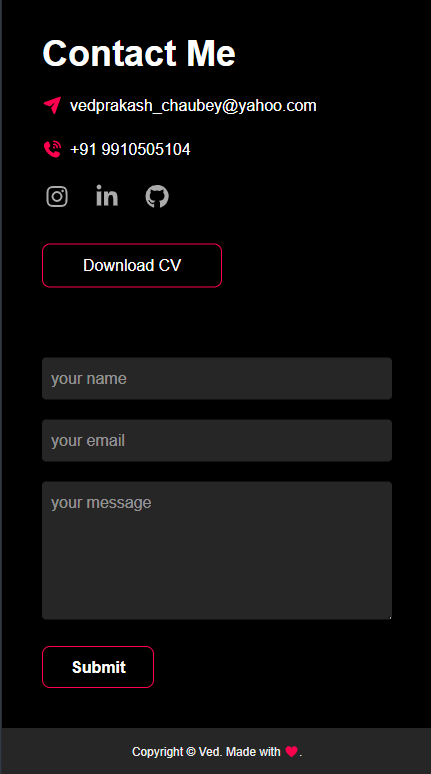

# 🚀 Ved Prakash – Frontend / Full-Stack Developer Portfolio

This repository contains the source code of my **personal developer portfolio**, built using **Next.js, React, and Tailwind CSS**, to showcase my projects, skills, and professional journey as a Frontend / Full-Stack Developer.

🌐 **Live Portfolio:**  
https://portfolio-omega-two-e1uw8c20us.vercel.app/

📂 **GitHub Repository:**  
https://github.com/VedPrakash-cloud/portfolio

---

## ✨ Overview

I am a **Frontend / Full-Stack Developer** with hands-on experience in building modern, responsive, and scalable web applications using **React, Next.js, and the MERN stack**.

Along with strong technical skills, I bring **14+ years of team leadership and client-facing experience**, which helps me design solutions aligned with real business requirements and user needs.

---

## ✨ Key Features

- ⚡ Built with **Next.js (App Router)**
- 🎨 Clean & responsive UI using **Tailwind CSS**
- 🧩 Reusable and modular React components
- 📱 Fully responsive across all devices
- 🚀 Deployed on **Vercel**
- 📄 Resume download & contact section
- 🔍 SEO-friendly structure

---
## 📸 Desktop Screenshots

### Home Page


### About Section


### Services Section


### Project Section


### Contact Section


## 📱 Mobile Screenshots

### Home Page


### Hero Section


### About Section


### Services Section


### Project Section


### Contact Section



## 🛠️ Tech Stack

### Frontend
- React.js
- Next.js
- JavaScript (ES6+)
- TypeScript (Basic)
- Tailwind CSS
- Material UI

### Backend & APIs
- REST APIs
- JWT Authentication (project based)

### Tools & Platforms
- Git & GitHub
- Vercel
- Netlify
- ESLint
- PostCSS

---

## 📁 Project Structure

```bash
src/
├── app/
│   ├── page.tsx            # Home page
│   ├── layout.tsx         # Root layout
│   ├── globals.css
│   ├── favicon.ico
│   ├── about/
│   │   └── about.tsx
│   ├── contact/
│   │   └── contact.tsx
│   ├── hero/
│   │   └── hero.tsx
│   ├── profile/
│   │   └── profile.tsx
│   └── services/
│       └──services.tsx
│
├── components/
│   ├── Navbar.tsx
│   ├── Footer.tsx
│   ├── Hero.tsx
│   ├── ProjectCard.tsx
│   └── ContactForm.tsx
│
├── utils/
│   └── constants.ts
│
├── hooks/
│   └── useScroll.ts
│
└── styles/
    └── globals.css

